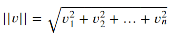
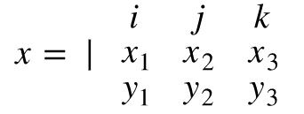
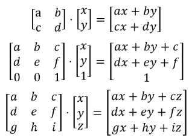

## Q
What are some basic applications of linear algebra in Data Science?

## A
* **Vectors**: Rows, Columns, Lists, Arrays
* **Matrices**: Tables, Spreadsheets, DataFrames
* **Linear Modeling**: Linear Regression, Logistic Regression, Gradient Descent, etc.

----

## Q
What is a **Scalar**?

## A
A **scalar** is a single number that is positive, negative, 0 or any other real number.

```python
scalar = 1
scalar = -10.5
```

---

## Q
What is a **Vector**?

## A
A **vector** of dimension *n* is an **ordered** collection of *n* elements, which are called **components** (components of vectors are *not* referred to as "scalars")

```python
vect = [2, 4.6, -1, 9]

import numpy as np
vect = np.array([2, 4.6, -1, 9])
```

---

## Q
What is the **Norm** of a vector?

## A
The **norm** or **magnitude** of a vector is nothing more than its **length**. Since a vector is just a line (essentially), we can think of it as the hypotenuse of a triangle and use the pythagorean theorem to find the norm of the vector. We're essentially generalizing the equation for the hypotenuse of a triangle to n dimensional space:



```python
def vector_norm(vector: List):
    return (sum([vector[i]**2 for i in range(len(vector))])**.5)
```

---

## Q
What is the **Dot Product** of two vetors? What does it produce?

## A
The dot product of two vectors `a` and `b` produces a scalar quantity that is equal to the sum of pair-wise products of the vectors' components. The dot product is commutative and distributive.


```python
def vector_dot_product(vector1, vector2):
    assert len(vector1) == len(vector2), 'Expected Vectors of Equal Length'

    return sum([vector1[i]*vector2[i] for i in range(len(vector1))])
```

---

## Q
How do we find the **Cross Product** of two vectors? What does it produce?

## A
The **Cross Product** of two vectors produces a third vector that is perpendicular to the first two vectors. 
It is written with a regular looking multiplication sign like `a X b` but is read as "a cross b".

The cross product can be found by creating a 3X3 matrix from the two vectors and the unit vector and then finding the determinant of the 3x3 matrix.



---

## q
What is a **Matrix**? What is its **Dimensionality**?

## a
A **matrix** is a rectangular grid of numbers arranged in rows and columns. The **dimensions** of the matrix are its number of rows and columns (in that order).

These matrices are 2X4:

```python
vect = [[2, 4.6, -1, 9],
        [5,   1,  0, 2]]

import numpy as np
vect = np.array([[2, 4.6, -1, 9],
                 [5,   1,  0, 2]])
```

---

## Q
What is **Matrix Equality**?

## A
Two matrices that have the same dimensions, and their corresponding elements are equal.

----

## q
How do we conduct **Matrix Multiplication**? What does it accomplish?

## a
**Matrix multiplication** applies a transformation like shrinkage, expansion, or rotation.

We can multipy two matrices only if the number of columns of the first matrix is equal to the number of rows of the second matrix.

The unused dimensions of the factor matrices tell us what the dimensions of the product matrix will be. A 2X3 matrix multiplied by a 3X2 matrix will produce a 2X2 matrix.

There is no commutative property of matrix multiplication (we can't switch the order of the matrices and always get the same result).

Matrix multiplication is best understood in terms of vector dot products. To multiply two matrices together, we can take the dot product of each row of the first matrix and each column of the second matrix. The position of the resulting entries will correspond to the row number and column number of the row and column vector that were used to find that scalar.



```python
def matrix_multiply(matrix1, matrix2):
    matrix1_n_cols = len(matrix1[0])
    matrix2_n_rows = len(matrix2)
    assert matrix1_n_cols == matrix2_n_rows, 'Matrix1 Columns != Matrix2 Rows'

    matrix2 = transpose_matrix(matrix2)  # makes it easier to find cols by index
    product = []
  
    for i, matrix1_row in enumerate(matrix1):
        product.append([])
        for j, matrix2_col in enumerate(matrix2):
            product[i].append(vector_dot_product(matrix1_row, matrix2_col))
    return product

def vector_dot_product(vector1, vector2):
    assert len(vector1) == len(vector2), 'Expected Vectors of Equal Length'

    return sum([vector1[i]*vector2[i] for i in range(len(vector1))])

def transpose_matrix(matrix):
    return list(map(list, zip(*matrix)))
```

---

## Q
What is the **Transpose** of a matrix?

## A
A transposed matrix is rotated such that its rows are the columns of the original and its columns are the rows of the original.

---

## Q
What is a **Square Matrix**? What are some examples?

## A
A **square matrix** is any matrix that has the same number of rows as columns.

* **Identity Matrix**: A diagonal matrix with ones on the main diagonal and zeroes everywhere else.


* **Symmetric**: The numbers above the main diagonal are mirrored below/across the main diagonal.


* **Diagonal**: Values on the main diagonal, zeroes everywhere else.
* **Upper Triangular**: Values on and above the main diagonal, zeroes everywhere else.
* **Lower Triangular**: Values on and below the main diagonal, zeroes everywhere else.

---

## Q
What is the result of multiplying any **Square Matrix** by the **Identity Matrix**?

## A
The result is the original matrix, similar to multiplying any number by 1.

---

## Q
What is the result of multiplying any matrix by its inverse?

## A
Any matrix multiplied by its inverse will give the **Identity Matrix** as its product.

---

## Q
How do we find the **Determinant** of a Matrix? What kinds of matrices have this property?

## A
The **determinant** is a scalar value computed from any *square matrix*, denoted as `det(A)` or with pipes, `|A|`. Calculating a determinant by hand is probably beyond the utility/scope of regular data science work, but it can be done with a recursive function.


```python
import numpy as np

mtx = [[1, 4, 2, 2],
       [6, 4, 6, 2],
       [1, 5, 7, 0],
       [0, 2, 4, 1]]

detrmt = np.linalg.det(np.array(mtx)))
```

```python
def matrix_determinant(matrix):
  assert is_square_matrix(matrix), 'Expected Square Matrix'

  # if a 2x2 matrix, solve
  if len(matrix) == len(matrix[0]) == 2:
    return (((matrix[0][0]) * (matrix[1][1])) - 
            ((matrix[1][0]) * (matrix[0][1])))

  total = 0

  # iterate over every column
  for col_i in range(len(matrix)):
    # submatrix excluding top row
    sub_mtx = matrix[1:]

    # update submatrix row slices
    for i in range(len(sub_mtx)):
      sub_mtx[i] = sub_mtx[i][0:col_i] + sub_mtx[i][col_i+1:]

    # calculate the sub_determinant by recursion
    sub_determinant = matrix_determinant(sub_mtx)

    # 1 or -1 for even/0 or odd column index, respectively
    sign = (-1) ** col_i

    # add the sub_determinant to the total
    total += sign * matrix[0][col_i] * sub_determinant

  return total

def is_square_matrix(matrix):
  for row in matrix:
    if len(row) != len(matrix):
      return False
  return True
```

```python
mtx = np.random.rand(3, 3)
assert np.isclose(matrix_determinant(mtx.tolist()),
                  np.linalg.det(np.array(mtx)))
```

---

## Q
What is the **Inverse** of a matrix? What kinds of matrices are invertible?

## A
The **Inverse** is a matrix that acts like a reciprocal of a given origin matrix, just like 1/8 is the reciprocal of 8.

Conditions:
1. The matrix must be square
1. The matrix must have a non-zero determinant. In the process of computing the inverse, we divide by the determinant, and we cannot divide by zero.

There are multiple methods that we could use to find the inverse of a matrix by hand, but they are beyond the utility and scope of this resource.

```python
import numpy as np

matrix = np.array([[1, -7],
                   [0, 20]])
invers = np.linalg.inv(matrix)
print(invers)
```
```
>>> [[1.   0.35]
     [0.   0.05]]
```

---
